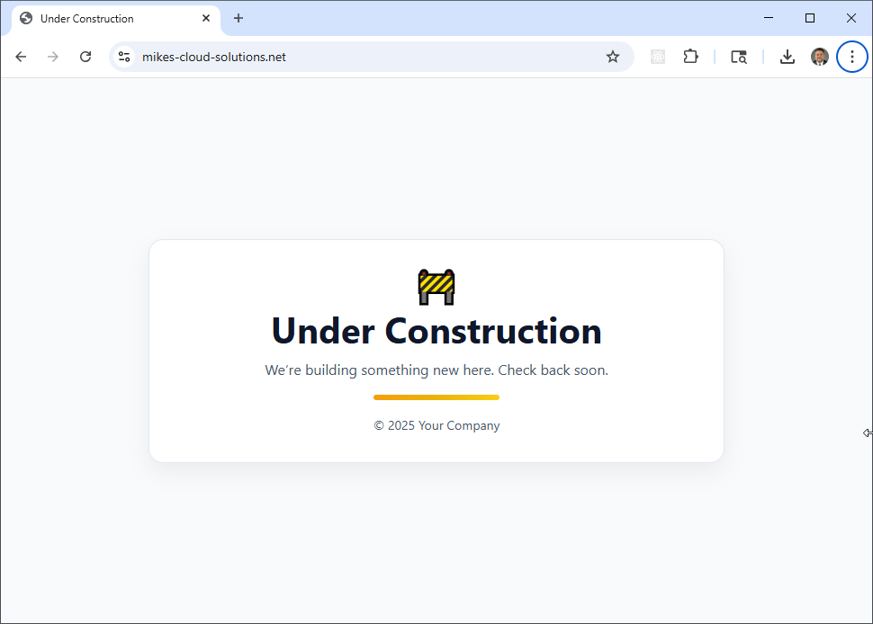
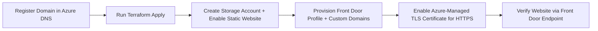

## Simple Website in Azure with Terraform & Front Door

This project automates the deployment of a fully secure, production-ready **static website on Microsoft Azure**, leveraging **Terraform** for infrastructure-as-code and **Azure Front Door** for global HTTPS delivery. The site’s content is hosted in an **Azure Storage Account (Static Website)** and delivered worldwide through **Front Door**, using an **Azure-managed TLS certificate** to ensure fast and secure access from any location.

The included Bash scripts (`apply.sh`, `check_env.sh`, and `destroy.sh`) streamline the complete lifecycle — from environment validation and provisioning to clean teardown — making this an ideal foundation for hosting static websites, documentation portals, or lightweight landing pages in Azure.



**Note:** The only manual step in this process is **domain registration**. This project assumes that you register your domain manually in the **Azure Portal** (via **Azure DNS**). Once the domain and DNS zone are created, Terraform takes over — automating the remainder of the deployment, including static website storage, Front Door configuration, and TLS certificate provisioning. In the accompanying video tutorial, we walk through these manual domain registration steps in the Azure Portal before transitioning into the Terraform automation.


## Key Features

- **Manual Domain Setup**: Domain registration is handled in the Azure Portal using Azure DNS; all subsequent steps are fully automated through Terraform and scripts.  
- **Infrastructure as Code (IaC)**: All Azure resources (Storage Account, Front Door, DNS records, etc.) are defined declaratively in Terraform for consistency and version control.  
- **HTTPS Everywhere**: Automatically provisions and binds an Azure-managed TLS certificate through Front Door, ensuring secure access over HTTPS.  
- **Secure Origin Access**: Uses **Front Door Origin Groups** and **Private Endpoints (optional)** to protect the Storage Account from direct public access, routing all traffic through Front Door.  
- **Automated Lifecycle**: Companion shell scripts manage provisioning, validation, and destruction, simplifying deployment and teardown workflows.  
 

## Prerequisites

* [A Registered Domain](https://learn.microsoft.com/en-us/azure/app-service/manage-custom-dns-buy-domain)
* [An Azure Account](https://portal.azure.com/)
* [Install AZ CLI](https://learn.microsoft.com/en-us/cli/azure/install-azure-cli) 
* [Install Latest Terraform](https://developer.hashicorp.com/terraform/install)

If this is your first time watching our content, we recommend starting with this video: [Azure + Terraform: Easy Setup](https://www.youtube.com/watch?v=wwi3kVgYNOk). It provides a step-by-step guide to properly configure Terraform and the AZ CLI.

## Deployment Flow



*Figure 1: End-to-end build process for the simple Azure website.*

## Download this Repository

```bash
git clone https://github.com/mamonaco1973/azure-website.git
cd azure-website
```

## Build the Code

Run [check_env](check_env.sh) then run [apply](apply.sh).

```bash
~/azure-website$ ./apply.sh
NOTE: Validating that required commands are found in your PATH.
NOTE: aws is found in the current PATH.
NOTE: terraform is found in the current PATH.
NOTE: jq is found in the current PATH.
NOTE: All required commands are available.
NOTE: Checking AWS cli connection.
NOTE: Successfully logged into AWS.
NOTE: Building networking infrastructure.
Initializing the backend...
Initializing provider plugins...
- Finding latest version of hashicorp/aws...
- Finding latest version of hashicorp/random...
- Installing hashicorp/aws v5.96.0...
- Installed hashicorp/aws v5.96.0 (signed by HashiCorp)
- Installing hashicorp/random v3.7.2...
- Installed hashicorp/random v3.7.2 (signed by HashiCorp)
Terraform has created a lock file .terraform.lock.hcl to record the provider
selections it made above. Include this file in your version control repository
so that Terraform can guarantee to make the same selections by default when
you run "terraform init" in the future.

Terraform has been successfully initialized!
```

## Build Results

After a successful run of `apply.sh`, Terraform provisions a complete static website infrastructure on Azure. The following resources are created and configured automatically:

| Component | Description |
|------------|--------------|
| **Storage Account (Static Website)** | Hosts all website content (e.g., `index.html`). Static website hosting is enabled on the `$web` container, with direct public access disabled. |
| **Azure Front Door Profile** | Provides global HTTPS delivery and intelligent routing. It uses the Storage Account as the backend origin and automatically redirects all HTTP traffic to HTTPS. |
| **Azure-Managed TLS Certificate** | Secures the Front Door custom domains with SSL/TLS encryption. Certificates are automatically issued and renewed by Azure. |
| **Azure DNS Zone** | Hosts DNS records for the manually registered domain (created in the Azure Portal). Terraform creates the necessary A and TXT records for domain validation and routing. |

Once the build completes, you can run the provided **`validate.sh`** script to confirm that the website is online and responding with an HTTP 200 status code:

```bash
./validate.sh
```

When the script reports `NOTE: URL is reachable`, your website is live and secured over HTTPS.  
The default `index.html` displays an **“Under Construction”** page, which can later be replaced with your production site content.


**Teardown:**  

Before running the `destroy.sh` script, ensure that your domain is **not locked** against DNS record deletions.  
By default, newly registered domains in Azure have a **delete lock** applied to prevent accidental removal of DNS entries.  

You can remove this lock from the **Azure Portal** by navigating to your **DNS zone**, selecting the **Locks** blade, and deleting any existing **Delete** locks before proceeding.

To remove all resources run:

```bash
./destroy.sh
```
This command safely destroys all Terraform-managed infrastructure while leaving your manually registered domain intact.

