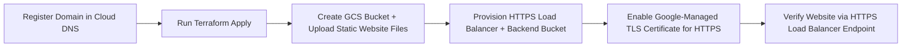

## Simple Website in GCP with Terraform & HTTPS Load Balancer

This project automates the deployment of a fully secure, production-ready **static website on Google Cloud Platform (GCP)**, leveraging **Terraform** for infrastructure-as-code and the **Google Cloud HTTPS Load Balancer** for global, encrypted content delivery.  
The site’s content is hosted in a **Google Cloud Storage (GCS) bucket**, served through the load balancer, and secured with a **Google-managed TLS certificate**, ensuring fast and reliable access from anywhere in the world.

The included Bash scripts (`apply.sh`, `check_env.sh`, and `destroy.sh`) streamline the entire lifecycle — from environment validation and provisioning to clean teardown — making this an ideal foundation for hosting static websites, documentation portals, or lightweight landing pages in GCP.


**Note:** The only manual step in this process is **domain registration**. This project assumes that you register your domain manually using **Google Cloud Domains** (or another registrar) and configure it in **Cloud DNS**.  
Once the domain and DNS zone are created, Terraform automates the rest — including the creation of the GCS bucket, HTTPS load balancer, backend configuration, and TLS certificate provisioning. In the accompanying video tutorial, we walk through these manual domain setup steps in the Cloud Console before transitioning into Terraform automation.


## Prerequisites

* [A Registered Domain](https://cloud.google.com/domains/docs/register-domain)
* [Install gcloud CLI](https://cloud.google.com/sdk/docs/install) 
* [Install Latest Terraform](https://developer.hashicorp.com/terraform/install)
* [Install Latest Packer](https://developer.hashicorp.com/packer/install)

If this is your first time watching our content, we recommend starting with this video: [GCP + Terraform: Easy Setup](https://youtu.be/3spJpYX4f7I). It provides a step-by-step guide to properly configure Terraform, Packer, and the gcloud CLI.

## Deployment Flow



*Figure 1: End-to-end build process for the simple GCP website.*

## Download this Repository

```bash
git clone https://github.com/mamonaco1973/gcp-website.git
cd gcp-website
```

## Build the Code

Run [check_env](check_env.sh) and [api_setup](api_setup.sh) then run [apply](apply.sh).

```bash
~/gcp-website$ ./apply.sh
NOTE: Running environment validation...
NOTE: Validating that required commands are found in the PATH.
NOTE: gcloud is found in the current PATH.
NOTE: terraform is found in the current PATH.
NOTE: jq is found in the current PATH.
NOTE: All required commands are available.
NOTE: Validating credentials.json and test the gcloud command
Activated service account credentials for: [terraform-builder@mikes-cloud-solutions.iam.gserviceaccount.com]
NOTE: Building Simple Website in GCP...
Initializing the backend...
Initializing provider plugins...
- Reusing previous version of hashicorp/google from the dependency lock file
- Using previously-installed hashicorp/google v7.7.0

Terraform has been successfully initialized!
```

## Build Results

After a successful run of `apply.sh`, Terraform provisions a complete static website infrastructure on **Google Cloud Platform (GCP)**.  
The following resources are created and configured automatically:

| Component | Description |
|------------|--------------|
| **Google Cloud Storage (GCS) Bucket** | Hosts all website content (e.g., `index.html`, `404.html`). Configured as a **backend bucket** for the HTTPS Load Balancer with direct public access disabled. |
| **HTTPS Load Balancer** | Provides global HTTPS delivery and intelligent routing. It uses the GCS bucket as its backend and automatically redirects all HTTP traffic to HTTPS. |
| **Google-Managed TLS Certificate** | Secures the custom domain with SSL/TLS encryption. Certificates are automatically issued, validated, and renewed by Google. |
| **Cloud DNS Zone** | Hosts DNS records for the manually registered domain (created in the Cloud Console). Terraform creates the necessary **A** and **CNAME** records for domain validation and routing. |

Once the build completes, you can run the provided **`validate.sh`** script to confirm that the website is online and responding with an HTTP 200 status code:

```bash
./validate.sh
```

When the script reports `NOTE: URL is reachable`, your website is live and secured over HTTPS.  
The default `index.html` displays an **“Under Construction”** page, which can later be replaced with your production site content.

---

**Teardown:**

To remove all resources, run:

```bash
./destroy.sh
```

This command safely destroys all Terraform-managed infrastructure while leaving your manually registered domain intact.
